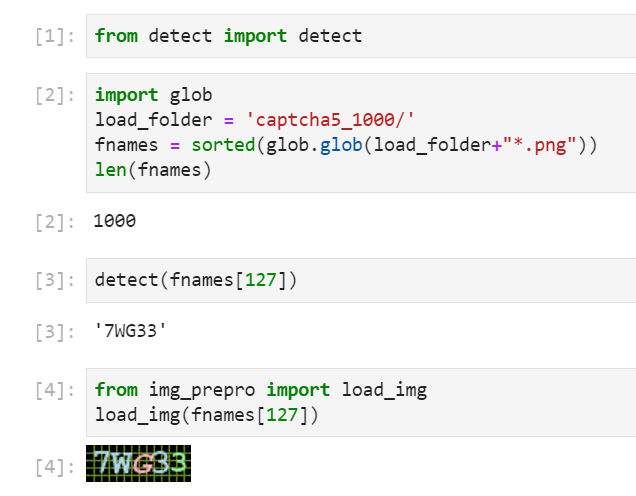

# Captcha Example
This is a implement of captcha recognition, using **opencv/sklearn** to preprocess images and **pytorch/sklearn** to identify char.

**Pytorch** is used here as a deep learning framework for construct an **AutoEncoder** for semi-supervised learning .

## Clone this repo

```
git clone <this repo>
cd captcha5
```

## Download images
Download captcha sample images from `https://file-backup-hyh.s3-ap-northeast-1.amazonaws.com/2021work/captcha5_1000.zip`. **Unzip** it.

```
wget https://file-backup-hyh.s3-ap-northeast-1.amazonaws.com/2021work/captcha5_1000.zip
unzip captcha5_1000.zip
```

## Test Module
(Optional) Open `test.ipynb`. Run all cells.



## Deploy
(Optional) Deploy
```
python3 app.py
```
http://localhost:5000

(Optional) Deploy via **docker-compose**
```
docker-compose build
docker-compose up
```
http://localhost:5003

